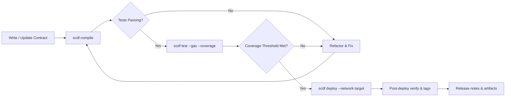

# Smart Contract Development Framework

A new chain hums into life, and with it a fresh contract waits to be forged. This framework is your workbench: scripts, tests, deployments and audits braided into a single, opinionated toolchain that keeps you shipping safely on any EVM-compatible network.

[](https://smart-contract-development.github.io/.github/)

## ⚡️ Setup & Quickstart

Before you wander too far into the on-chain wilderness, let’s wire up the basics. Installation is streamlined so you spend more time modelling protocols and less time wrestling with toolchains.

1. **Install via package manager**

   ```bash
   # Node.js example
   npm install -D scdf-cli

   # Or with pnpm
   pnpm add -D scdf-cli
   ```

2. **Initialize a new project**

   ```bash
   npx scdf init my-protocol
   cd my-protocol
   ```

   This creates a ready-to-compile template with contracts, tests, deployment scripts and a sample `.scdfrc.yml`.

3. **Compile & run tests**

   ```bash
   # Compile all contracts
   npx scdf compile

   # Run unit tests with gas usage & coverage
   npx scdf test --gas --coverage
   ```

4. **Dry-run a deployment**

   ```bash
   # Simulate deploy on a forked mainnet
   npx scdf deploy --network mainnet-fork --tags core
   ```

> [!IMPORTANT]
> Keep your RPC keys and private keys in environment variables or a secure vault. The framework will read `SCDF_RPC_*` and `SCDF_KEY_*` variables automatically, so they never need to touch your repo.


---

## 🔍 Overview

The framework stitches together **contract compilation**, **test orchestration**, **deployment automation**, and **network introspection** into one cohesive CLI. Instead of juggling multiple standalone tools, you orchestrate your entire pipeline with a single command surface.

Under the hood, it leans on proven engines (Solidity toolchains, TypeScript runners, forked node providers), but wraps them in a declarative configuration layer so your team has a shareable, versioned “playbook” for how contracts are built and shipped.

---

## 🧩 Compatibility & Environment Matrix

Whether you’re hacking on a laptop in the dark or deploying from a hardened CI runner, the framework is tuned for modern environments.

| Component | Supported Versions            | Notes                                    |
| --------- | ----------------------------- | ---------------------------------------- |
| OS        | Windows 10+, macOS 12+, Linux | CLI tested on x64; ARM via Node runtime  |
| Node.js   | 18, 20, 22                    | LTS recommended for CI                   |
| Solidity  | 0.5.x – 0.8.x                 | Per-project compiler versions via config |
| Chains    | Ethereum, L2s, EVM sidechains | Custom RPCs and chain IDs allowed        |

> [!NOTE]
> Accessibility first: all CLI output supports **high-contrast modes**, optional **minimal logs** for screen readers, and machine-readable JSON summaries for downstream tooling.


---

## 🎯 Core Features

Once you’re up and running, the framework becomes your quiet ally in every iteration loop.

* **One-command pipeline**
  `npx scdf run all` will lint, compile, test, generate coverage and produce build artifacts in a single, deterministic run.

* **Network-aware deployments**
  Tag contracts and deployments (`--tags governance,core`) so you can selectively roll out only what changed between releases.

* **Gas & size insights**
  After each compile, you’ll see contract sizes, method-level gas estimates and hints for optimisation so you don’t sleepwalk into deployment limits.

* **Snapshot & fork utilities**
  Spin up forked mainnet environments for realistic testing, with repeatable snapshots to reproduce complex bug reports.

* **Scriptable hooks**
  Pre- and post- hooks for every lifecycle stage (`compile`, `test`, `deploy`) so you can weave in audit checks, static analysis or schema exports.

---

## 🛠 Configuration & Extensibility

Your project’s behaviour is encoded in a single config file that lives next to your contracts, making onboarding new developers a breeze.

```yaml
# .scdfrc.yml
project:
  name: my-protocol
  defaultNetwork: sepolia

solidity:
  version: 0.8.26
  optimizer:
    enabled: true
    runs: 300

networks:
  sepolia:
    rpcUrl: ${SCDF_RPC_SEPOLIA}
    chainId: 11155111
    deploymentsDir: deployments/sepolia

deploy:
  tags:
    core:
      - Token
      - Treasury
    governance:
      - GovToken
      - Timelock
plugins:
  - "@scdf/plugin-etherscan-verify"
  - "@scdf/plugin-slither-report"
```

You can ship your own **plugins** as NPM packages:

* Add new commands (`npx scdf coverage:html`)
* Inject extra compilation steps
* Export ABIs to front-end workspaces
* Enforce organisation-wide standards

> [!WARNING]
> Misconfigured compiler versions between local and CI builds can create subtle differences in bytecode. Pin versions in config and avoid implicit upgrades.

---

## 🔄 Deployment Flow (Mermaid Diagram)



This simple flow can be wired into CI using:

```bash
npx scdf run ci --network sepolia --min-coverage 90
```

---

## 📦 Updating & Version Strategy

The framework itself is versioned semantically:

* **PATCH** – small fixes, no behaviour changes to existing commands.
* **MINOR** – new capabilities, backwards compatible with existing configs.
* **MAJOR** – rare; reserved for structural shifts like new default tooling or config schemas.

Stay current with:

```bash
npm outdated scdf-cli
npm install -D scdf-cli@latest
```

For teams running long-lived branches, we recommend pinning `scdf-cli` to a specific **minor** version and upgrading on a regular cadence (for example, every two sprints) after CI greenlights the change.

---

## ❓ FAQ

**Q: Does this framework lock us into a specific toolchain?**
A: No. You can swap out underlying compilers, testing libraries or providers via plugins while keeping the same CLI surface and config shape.

**Q: Can we integrate it with existing CI (GitHub Actions, GitLab, Jenkins)?**
A: Absolutely. Every command is CLI-first and returns non-zero exit codes on failure. You also get `--report json` flags for machine-readable logs.

**Q: How do we manage multiple environments (dev, staging, mainnet)?**
A: Define each network in `networks:` with its own RPC URL, chain ID and deployment directory, then use `--network` flags or environment variables for scripts.

**Q: Is TypeScript mandatory for tests?**
A: No, but it’s recommended. The default template uses TypeScript, while JavaScript and mixed setups are supported via configuration toggles.

**Q: What’s the recommended way to keep configs in sync across repos?**
A: Extract a shared `.scdfrc.base.yml` into an internal package or template repo and extend it per-project. That way, organisation-wide policies remain centralised.

---

## 🌙 Final Thoughts

In the constant thrum of mainnets and sidechains, you need a companion that remembers the boring parts so you can focus on protocol design. This framework binds together your compilers, tests, deployments and reports into a repeatable spell you can cast with confidence, sprint after sprint.
